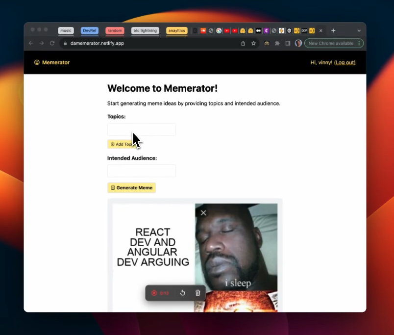

This is a repo for the Memerator meme generator app: https://damemerator.netlify.app/

It uses:
- [Wasp](https://wasp-lang.dev/) a full-stack React/NodeJS framework
- OpenAI's function calling API to call imgflip.com's API to generate memes

Please see the tutorial on how to build this app: https://dev.to/wasp/build-your-own-ai-meme-generator-learn-how-to-use-openais-function-calls-1p21